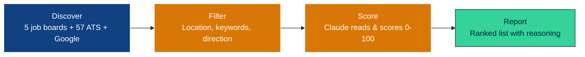
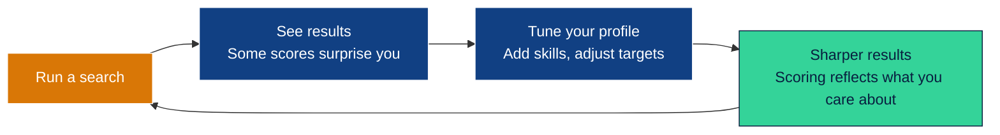

<div align="center">

<br>

# You Already Know What You Want. The Problem Is Finding It.

**An AI-powered job search tool that scans thousands of postings, scores them against your career story, and tells you which ones are actually worth your attention.**

You talk to Claude Code. It handles the rest.

<br>

[](https://claude.ai/claude-code)
[](https://mvpclub.ai)
[](https://python.org)
[](LICENSE)

<br>

</div>

---

<details>
<summary><strong>Table of Contents</strong></summary>

- [The Problem](#the-problem)
- [What If You Could Read Every Single One?](#what-if-you-could-read-every-single-one)
- [Your First Win](#your-first-win)
- [What Setup Looks Like](#what-setup-looks-like)
- [The Flywheel: Why It Gets Better](#the-flywheel-why-it-gets-better)
- [What the Scores Mean](#what-the-scores-mean)
- [Things You Can Say](#things-you-can-say)
- [Make It Smarter: LinkedIn Data](#make-it-smarter-linkedin-data)
- [What to Do With Results](#what-to-do-with-results)
- [Your Data Stays Yours](#your-data-stays-yours)

</details>

---

## The Problem

You know what a great job looks like when you see it. The problem isn't judgment — it's volume. There are thousands of postings across dozens of boards, and the good ones are buried under noise. You can't read them all, so you use keyword filters that miss context, or you scroll until your eyes glaze over, or you just apply to whatever shows up first.

Meanwhile, the perfect role — the one that actually fits your career trajectory — sits on page 4 of a board you didn't check.

## What If You Could Read Every Single One?

That's what this tool does. It scans 2,000+ jobs across five major boards, 57+ company career pages, and Google — then Claude reads each one and scores it against your actual career story. Not keywords. Your story: where you've been, what you're good at, where you're headed.



You get a ranked list. The best matches float to the top with scores, reasoning, salary estimates, and apply links. If you uploaded your LinkedIn connections, it flags when you know someone at the company.

> [!NOTE]
> A typical run scans **2,000+ jobs**, filters down to a few hundred, and scores the best matches — all automatically. The discovery and filtering are free. The AI scoring step uses the Claude API and costs a few dollars per run.

---

## Your First Win

The fastest way to understand what this tool does is to use it.

<table>
<tr>
<td width="50%">

### What you need

| What | Where to get it |
|---|---|
| **Your resume** (PDF, DOCX, or text) | Wherever you keep it — drop it in the project folder |
| **An Anthropic API key** | [console.anthropic.com](https://console.anthropic.com) |

That's it. Everything else is optional and can be added later.

</td>
<td width="50%">

### Clone, open, talk

```bash
git clone https://github.com/hasmatt1066/jobsearchtool.git
cd jobsearchtool
claude
```

Claude Code detects that you're new and walks you through everything — installs dependencies, reads your resume, builds your profile, and gets you running. No config files. No commands to memorize.

</td>
</tr>
</table>

> [!TIP]
> Drop your resume into the project folder **before** running `claude`. When Claude Code can read your resume, setup goes from 10 questions to 3 confirmations — it already knows your name, location, skills, and experience.

---

## What Setup Looks Like

Setup is a conversation, not a config file. Claude does the heavy lifting.

> **Claude Code:** I've read your resume. You're Sarah Chen, based in Austin, with 8 years in product management. Are you looking for remote roles?
>
> **You:** Remote preferred but I'd do hybrid.
>
> **Claude Code:** What kind of roles are you targeting? These might be different from your current title — where do you want to go?
>
> **You:** Product manager, senior PM, director of product... mostly at tech companies focused on AI or developer tools.

Claude builds your profile from this conversation, confirms it with you, and asks if you want to run your first search. A few minutes later:

> I found **64 matches** after scanning 2,142 jobs. Your best match is a **95/100** at OpenAI — an AI Adoption Manager role focused on enablement and training design. Salary likely $150k-$200k+.
>
> Want me to go deeper on any of these?

${\color{green}\text{That's your first win.}}$ You went from zero to a scored, ranked list of real opportunities. Everything after this is tuning.

---

## The Flywheel: Why It Gets Better

Your first search gives you a baseline. The real value comes from iteration.



Every interaction teaches the system more about what you want. The tool doesn't just find jobs — it helps you clarify what you're actually looking for.

---

## What the Scores Mean

<table>
<tr>
<td width="20%" align="center">

**0 – 39**
<br>
${\color{red}\text{Not for you}}$

</td>
<td width="20%" align="center">

**40 – 59**
<br>
${\color{orange}\text{Meh}}$

</td>
<td width="20%" align="center">

**60 – 74**
<br>
${\color{orange}\text{Worth a look}}$

</td>
<td width="20%" align="center">

**75 – 89**
<br>
${\color{green}\text{Strong match}}$

</td>
<td width="20%" align="center">

**90 – 100**
<br>
${\color{green}\text{Apply now}}$

</td>
</tr>
</table>

Every score comes with reasoning — what matched, what didn't, and what you'd need to address in your application. This is a cheat sheet for your cover letter: lead with the overlaps, address the gaps proactively.

---

## Things You Can Say

Once you're set up, just talk to Claude Code in plain English.

<details>
<summary><strong>Find jobs</strong></summary>

| You say | What happens |
|---|---|
| "Run a search" | Scans all sources, scores matches, generates a report |
| "Search for AI product roles at startups" | Runs a targeted search and scores results |

</details>

<details>
<summary><strong>Read results</strong></summary>

| You say | What happens |
|---|---|
| "What did you find?" | Summarizes your top matches with scores and reasoning |
| "Which jobs have network connections?" | Filters for jobs where you know someone |
| "Tell me more about the Anthropic job" | Gives a detailed breakdown of that specific match |

</details>

<details>
<summary><strong>Tune your profile</strong></summary>

| You say | What happens |
|---|---|
| "Add AI Strategy to my skills" | Updates your profile |
| "Change my salary floor to $180k" | Adjusts your minimum and future scoring |
| "I found my dream job posting, here it is..." | Saves it as your reference job to calibrate scoring |

</details>

<details>
<summary><strong>Manage your search</strong></summary>

| You say | What happens |
|---|---|
| "Start monitoring Stripe's career page" | Detects their ATS and adds them to your list |
| "I'm getting too many mediocre matches" | Raises your score threshold |
| "How's my search going overall?" | Shows stats — jobs scanned, top queries, network size |

</details>

---

## Make It Smarter: LinkedIn Data

Your LinkedIn export is the single highest-leverage upgrade. It unlocks two things:

<table>
<tr>
<td width="50%">

### Network matching

Your connections let the tool flag every job where you know someone. A warm intro changes everything, and the scoring engine knows it — borderline jobs get boosted when you have a connection.

</td>
<td width="50%">

### ATS expansion

Your Saved Jobs and Company Follows tell the tool which companies you care about. It auto-detects their career pages and adds them to monitoring, so you never miss a posting.

</td>
</tr>
</table>

> [!TIP]
> **How to get it:** LinkedIn → Settings → Data Privacy → Get a copy of your data. Select "Connections" at minimum. Also select "Jobs" and "Company Follows" for the full benefit. LinkedIn emails you a ZIP within ~24 hours. Unzip it into the project folder.

You can add this at any time — just tell Claude Code "I added my LinkedIn data" and it sets everything up.

---

## What to Do With Results

| | Action | Why |
|---|---|---|
| **1** | **Chase the 90+ scores** | They're rare. When one shows up, it's genuinely worth your attention. |
| **2** | **Reach out to connections first** | A warm intro is worth 10 cold applications. Message them before applying. |
| **3** | **Use the reasoning in your cover letter** | Claude tells you exactly what overlaps and gaps exist. Lead with the overlaps. |
| **4** | **Keep tuning your profile** | If roles you like score low, tell Claude Code to adjust. The next search will be sharper. |

---

## Your Data Stays Yours

> [!IMPORTANT]
> Your profile, API keys, LinkedIn connections, and search results **never leave your machine**. Everything personal is gitignored — the tool works locally and only you see your results.

---

<div align="center">

<br>

**[MVP Club](https://mvpclub.ai)** — Stop learning AI. Start building with it.

<br>

</div>
